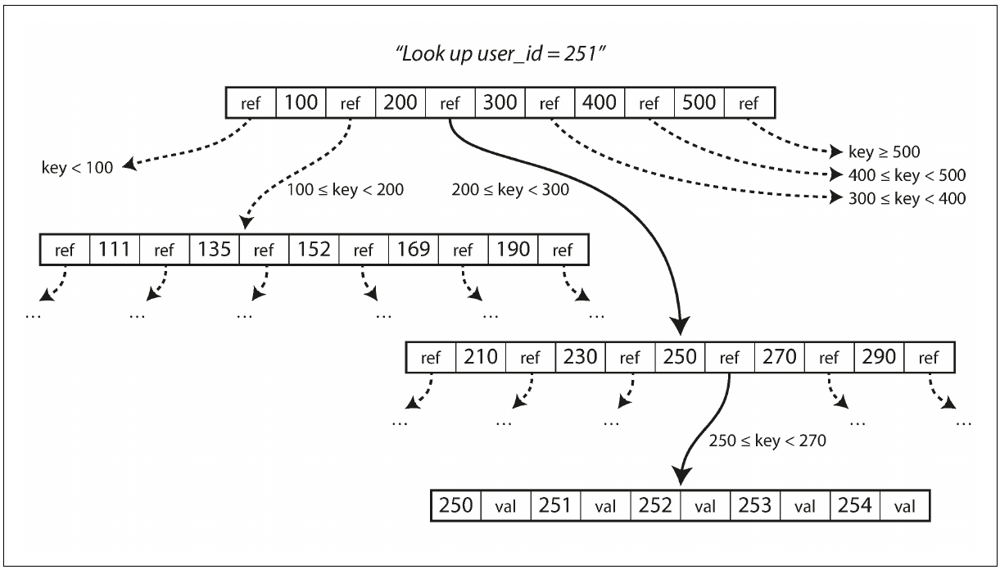

## B-Tree - page 80

Similar to a binary search tree, nodes in a tree are saved in an ordered way, except that every node can hold more than one value, and contains multiple references to other nodes. The number of references in a node is called ``Branching``. 

B-tree is a method of structuring data in the disk while still optimized to have fast retrieve pattern. Please note that it is not an in-memory data structure but rather an on disk one.

B-tree is the most used data structure to save data in most databases.

